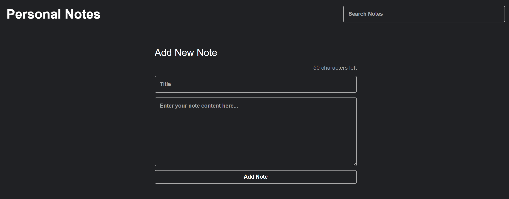

# 🗒️ Aplikasi Catatan Pribadi (React Notes App)

Aplikasi berbasis web yang dibangun menggunakan React.js untuk menulis, menampilkan, menghapus, mencari, serta mengarsipkan catatan pribadi secara interaktif.

## 🚀 Fitur
- Tambah, tampilkan, hapus, dan arsipkan catatan pribadi
- Fitur pencarian catatan berdasarkan judul
- Sistem arsip untuk memisahkan catatan aktif dan arsip
- Pembatasan karakter judul (maksimal 50 karakter)

## ⚙️ Teknologi
- React.js (dengan Vite)
- JavaScript (ES6+)
- CSS
- Bootstrap
- React Toastify
- SweetAlert2

## 📥 Prasyarat
Pastikan sudah menginstal Node.js

## 📦 Cara Menjalankan Project
1. Clone repository:
   ```bash
   git clone https://github.com/aldamrtz/CatatanKeuangan.git
2. Masuk ke folder project
   ```bash
   cd react-notes-app
5. Install dependencies
   ```bash
   npm install
7. Jalankan aplikasi
   ```bash
   npm run dev
9. Buka di browser "http://localhost:5173/"

## 🖼️ Tampilan Aplikasi
  

